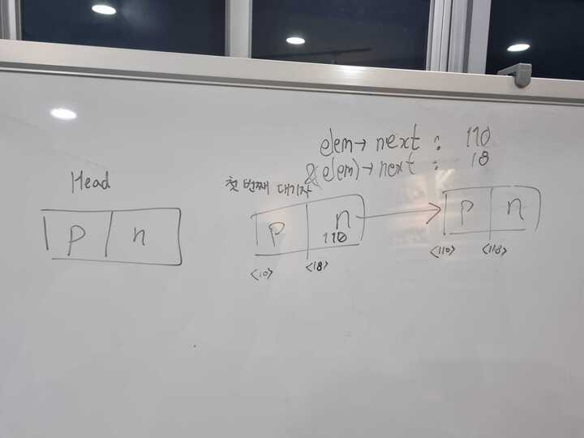

## Weekly I learned


## appendix thread

- `thread_init` 는 새 스레드 공간 할당하는데 `thread_start` 는 어떤 역할인지?
	- `thread_start` 함수가 호출되면, 스레드 스케줄링 알고리즘에 따라 현재 실행 중인 스레드보다 높은 우선 순위를 비교하여 스케줄러가 실행할 스레드를 선택합니다.
    - 스케줄러는 현재 스레드의 실행을 중단하고, 새로운 스레드로 컨텍스트 스위치를 수행합니다. 이렇게하면 새로운 스레드가 CPU를 점유하고 실행됩니다.
- main에서 idle 스레드는 ready queue에 다른 스레드가 기다리고 있는지 확인하지 않고 바로 생성하는 이유는?
    - 아직 ready queue에 들어가 있는 스레드가 없기 때문입니다.
	- idle 스레드를 생성하고 실행하는 이유는 시스템이 항상 어떤 스레드든 실행할 수 있도록 하는 것입니다. 따라서 CPU가 항상 활성 상태로 유지되며, 다른 스레드가 다시 실행 가능한 상태로 전환될 때까지 기다리지 않습니다. 이렇게 함으로써 운영 체제의 반응성을 보장하고 시스템이 대기 상태에 빠지는 것을 방지합니다.


## priority scheduling


<!-- - H가 L을 기다리는 상태 (blocking), M은 ready queue에 있는 상태, L은 H가 기다리는 lock을 가지고 있는 상태일때, L이 running으로 올라오자마자 바로 yield를 한다. 
- 나보다 높은 우선순위에 있는 스레드가 ready queue에 있다는 것은 어떻게 알지? yield를 하기 전에 자기가 직접 호출해야 하는건가?
- 우선순위 max를 갱신하면서 ready queue에서 꺼낼때 자기가 yield 할 지 안할지 판단하는 의견 나옴. 그러면 max는 언제 줄어드냐? -->

- priority-inversion이 발생하는 상황
    - 높은 우선순위 스레드가 낮은 우선순위 스렐드가 가진 공유 자원을 사용하기 위해 대기할 때 priority-inversion이 발생합니다.
    - H (high), M (medium), L (low) 라는 세 개의 스레드가 있고 각각의 우선순위는 H > M > L
    - H가 lock을 요청했는데 L이 lock을 점유하고 있어 가장 높은 우선순위를 가진 H가 block
    - 결국 H보다 낮은 우선순위를 가진 M이 H보다 먼저 CPU를 점유하게 됩니다.


- priority-inversion을 해결하는 방법
    - 높은 우선순위를 가진 H가 그 보다 낮은 우선순위를 가진 L에게 priority를 기부합니다.
    - 이로 인해 L의 CPU점유가 끝나고 높은 우선순위를 가진 H가 다음으로 CPU를 점유합니다.


## Alarm Clock

- 낮은 우선순위의 waiting 스레드 but 높은 우선순위의 blocking 스레드는 기부 당해서 running 상태로 먼저 올라가지 않을까?  


- busy waiting 방식을 사용하지 않게 타이머를 만들어라.
> busy waiting 방식이란 OS에서 원하는 자원을 얻기 위해 기다리는 것이 아니라 ***권한을 얻을 때까지 확인***하는 것을 의미합니다.
>

- tick
    - pintos에서 시간의 경과를 나타내는 개념으로 시스템 시간을 측정하고 관리하는 역할을 합니다.
    - 타이머 인터럽트는 일정한 간격으로 발생하며, 발생시 마다 'tick'을 증가시켜 스케줄링, 스레드 대기 시간 측정 및 시간 관련 기능에서 사용됩니다. 
- timer_sleep의 역할은?, tick은 어떻게 올라가는가, 스레드 호출의 실행을 중단한다고 했는데
	- 하드웨어 주파수에 일정 보정을 해서 `uint16_t count = (1193180 + TIMER_FREQ / 2) / TIMER_FREQ;` 인터럽트를 발생시키면 어떤 상황에서도 (심지어 인터럽트가 꺼져있어도) tick 값을 1 증가 시키는`timer_interrupt`와  
	- thread_ticks는 TIME_SLICE를 초과할 때마다 인터럽트를 발생시키고 thread_ticks를 0으로 초기화한다.
	- ticks는 단순 증가만 한다.
	- 


## priority-donate-multiple

## diagram

[[priority-donate-multiple.excalidraw]]

이번 프로젝트에서 ready list와 lock semaphore waiters list, destruction_req는 이미 `thread::elem` 멤버에 의해 자리가 보장되어있다. (왜 두 리스트에 대해서 하나의 멤버만으로 사용이 가능한지는 [다음 이슈](https://github.com/ChoiWheatley/swjungle-week07-09/issues/13)를 확인하라.) 하지만 우리가 새롭게 만든 리스트인 `thread::donate_list`는 언제나 blocked 상태인 스레드들이 들어가기 때문에 단순히 `thread::elem` 멤버를 사용했다간 연결 관계가 덮어씌워져 버린다.


위의 도표는 `thread::d_elem` 멤버변수를 선언하여 donate list의 원소로 사용한 모습이다. 이때 lock의 waiters 모두를 donate list에 넣지 않고 가장 큰 우선순위를 가진 스레드의 `d_elem`만 넣게 되는데, 이것이 우리 프로젝트 구현사항 중 가장 큰 특징이다. 같은 lock을 기다리고 있는 스레드들 중에서는 항상 큰 우선순위를 가진 스레드가 우선적으로 기부를 하기 때문에 굳이 다른 waiter를 기부자 목록에 올릴 필요가 없다. 덕분에 T1의 우선순위를 계산할 때 순회하는 시간이 줄어들었고, lock release할 때 같은 `wait_on_lock`을 가지로 있는 기부자 스레드만 제거하면 되어 코드의 양이 줄어든다. 이 방식으로 진행했을 때 `lock_acquire` 타이밍에 필요한 작업이 생긴다.

`lock_acquire`하려는 스레드가 lock 획득에 실패한 경우, lock holder에게 기부할지 여부를 결정해야 한다. lock holder의 우선순위보다 자신의 우선순위가 높고 이미 해당 lock의 대표 기부자보다 우선순위가 높은 경우엔 기존 기부자를 donate list로부터 삭제하고 자신을 donate list에 추가해야 한다. 다음 수도코드는 해당 작업에 대한 간략한 플로우를 설명한다.

```python
def lock_acquire(lock)
	if lock.semaphore.value == 0:
		# lock 획득에 실패
		cur_thread.wait_on_lock = lock
	
		if lock.holder.priority < cur_thread.priority:
			# do donation
			max_waiter = max(lock.semaphore.waiters)
			if list_empty(lock.semaphore.waiters):
				# 첫 빠따로 waiters 안에 들어있는 경우
				lock.holder.donate_list.append(cur_thread)
			else if max_waiter.priority < cur_thread.priority:
				# 기존 기부자를 자신으로 대치
				lock.holder.donate_list.remove(max_waiter)
				lock.holder.donate_list.insert_ordered(cur_thread)
```
## donate-nest / donate-chain

## diagram
priority-donate-chain 예제를 기준으로 설명합니다. 지면이 부족하므로 `NESTING_DEPTH == 3`으로 놓고 진행합니다.


`main` 스레드는 0번 lock을 소유합니다. 이를 'h' 달린 화살표료 표기합니다. T1 스레드는 1번 lock을 소유하고 0번 lock을 기다립니다. 이를 w 달린 화살표로 표기합니다. 다시 main에 의해 T2가 실행됩니다. T2 스레드는 2번 lock을 소유하고 1번 lock을 기다립니다. T3 스레드는 3번 lock을 소유하고 2번 lock을 기다립니다. 

`lock_acquire`에서 lock 획득에 실패할 경우, lock holder에게 자신의 priority를 기부할지 안할지를 결정합니다. lock 하나 당 하나의 waiter만이 lock holder에게 우선순위를 기부할 수 있습니다. 따라서 이미 같은 lock에 대하여 기부자가 있는 경우 이를 대체할 지 여부도 결정하여야 합니다.

예제에서 모든 자식 스레드를 만든 경우, 위의 도식과 같은 모양이 됩니다. 청록색 곡선은 스레드에 걸려있는 donation list의 원소를 나타냅니다. 예를 들어 T2 스레드의 donation list는 T3입니다. 따라서 `get_priority(T2)`의 결과는 `max(T2.donation_list) = T2.original_priority = 9`가 됩니다.

`get_priority` 함수는 재귀적으로 작동해야 합니다. 연쇄적으로 서로의 lock을 물고 있는 경우가 대표적입니다. 가장 높은 우선순위를 가진 T3가 빠르게 실행되기 위해선 2번 lock을 해제해야 하고, 그러기 위해선 T2가 빠르게 실행되어야 하고, 그러기 위해선 1번 lock을 해제해야 합니다. 그러기 위해선 T1이 빠르게 실행되어야 하고, 그러기 위해선 0번 lock을 해제해야 합니다. 결국 main이 T1, T2, T3 모두의 donation list 중 최고 priority로 힘입어 동작하게 되며, 결과적으로 main 스레드는 마치 T3의 우선순위를 기부받은 것처럼 동작하게 될 것입니다.

하지만 명시적으로 main 스레드가 받은 donation은 T1으로부터 받은것에 불과하므로 `get_priority`를 재귀적으로 호출하여 donate list가 없는 스레드가 나올 때까지, 즉 기부받은 스레드가 없을 때까지 반복적으로 `get_priority`를 호출하게 됩니다.

```c
/**
 * @brief Get the donated priority RECURSIVELY
 */
int get_priority(struct thread *target) {
  if (list_empty(&target->donation_list)) {
    // original priority
    return target->priority;
  }
  // not empty list
  struct list_elem *max_elem = list_max(&target->donation_list, priority_asc_d, NULL);

  return get_priority(get_thread_d_elem(max_elem));
}
```

`priority_asc_d`는 두 `d_elem`끼리 비교하여 두번째 인자가 첫번째 인자보다 더 큰 우선순위(기부받은 것을 포함하여)를 가진 경우 `TRUE`를 리턴하는 predicate 함수입니다.

`get_thread_d_elem` 함수는 일반화된 연결리스트 특성상 outer structure를 참조할 수밖에 없어 `list_entry`라는 매크로 함수를 사용해야 하는데, 이를 래핑한 헬퍼함수입니다. [[list {C}#Generic Linked List]]

## list_entry에 대한 질문

```c
void
cond_signal (struct condition *cond, struct lock *lock UNUSED) {
	ASSERT (cond != NULL);
	ASSERT (lock != NULL);
	ASSERT (!intr_context ());
	ASSERT (lock_held_by_current_thread (lock));

	if (!list_empty (&cond->waiters))
		sema_up (&list_entry (list_pop_front (&cond->waiters),
					struct semaphore_elem, elem)->semaphore);
}

#define list_entry(LIST_ELEM, STRUCT, MEMBER) ((STRUCT *) ((uint8_t *) &(LIST_ELEM)->next - offsetof (STRUCT, MEMBER.next)))
```
### 1. 질문 
- 특정 condition에서 깨워야 할 대기자 list가 비워져있지 않다면 그 대기열에서 head 뒤에 있는 첫 번째 대기자를 pop하게 되는 것(list_pop_front)으로 이해했습니다.

- 그런데 이 때 list entry를 하게 되면 pop을 한 첫 번째 대기자의 next elem인 두 번째 대기자의 semaphore_elem을 참조하여 두 번째 대기자의 semaphore를 다운시키는 것으로 해석을 하였는데 제가 잘못 이해한건가요??

- (제대로 이해한 것이 맞다면) 왜 두 번째 대기자의 semaphore를 다운시키는 것인지, 그렇다면 첫 번째 대기자는 이미 깨어있는 상태라는 것 같은데 왜 대기자 list에 들어있는 것인지, 대기자가 한 명 밖에 없다면 그 첫 번째 대기자는 어떻게 깨울 수 있는 것인지도 궁금합니다.

>1. 답변
보여주신 코드는 두 번째 대기자를 깨우는 것이 아닌 첫 번째 대기자를 깨우는 코드입니다.
설명을 드리자면
list_pop_front(&cond->waiters) 를 하면 waiters 리스트에서 첫번째 원소를 뺀다음, 제거된 원소에 대한 list_elem의 포인터를 반환합니다.
그 포인터에 대해서 list_entry를 함으로써 첫번째 대기자의 semaphore_elem 구조체의 위치를 찾고
그 구조체에 대해서 ->semaphore 를 하므로
제거된 첫번째 원소에 해당하는 대기자를 깨우는 코드입니다.
>
<br>

### 2. 질문 
list_entry의 코드를 보면 ((STRUCT *) ((uint8_t *) &(LIST_ELEM)->next - offsetof (STRUCT, MEMBER.next))) 에서 & list_pop_front(&cond->waiters)->next이 waiters 리스트에서 제거된 첫 번째 대기자의 next로 이동해서 두 번째 대기자의 주소값이 되는 것 아닌가요?

>2. 답변
&(LIST_ELEM)->next 는 next를 참조해서 next node의 위치를 읽어오는게 아니라, LIST_ELEM의 'next'라는 필드가 위치해 있는 메모리 주솟값만을 계산하는 코드입니다. 그래서 그래서 다음 대기자가 아닌 현재 대기자의 struct semaphore_elem 의 위치를 찾아냅니다.
>

## 문제 해결



* 위 그림과 같은 원리로 아래와 같이 매크로를 수정해도 원하는 주소값을 찾을 수 있습니다.
```c
#define list_entry(LIST_ELEM, STRUCT, MEMBER) ((STRUCT *) ((uint8_t *) &(LIST_ELEM)->prev - offsetof (STRUCT, MEMBER.prev)))
```
- 비슷한 질문에 대한 조교님의 예전 답변


