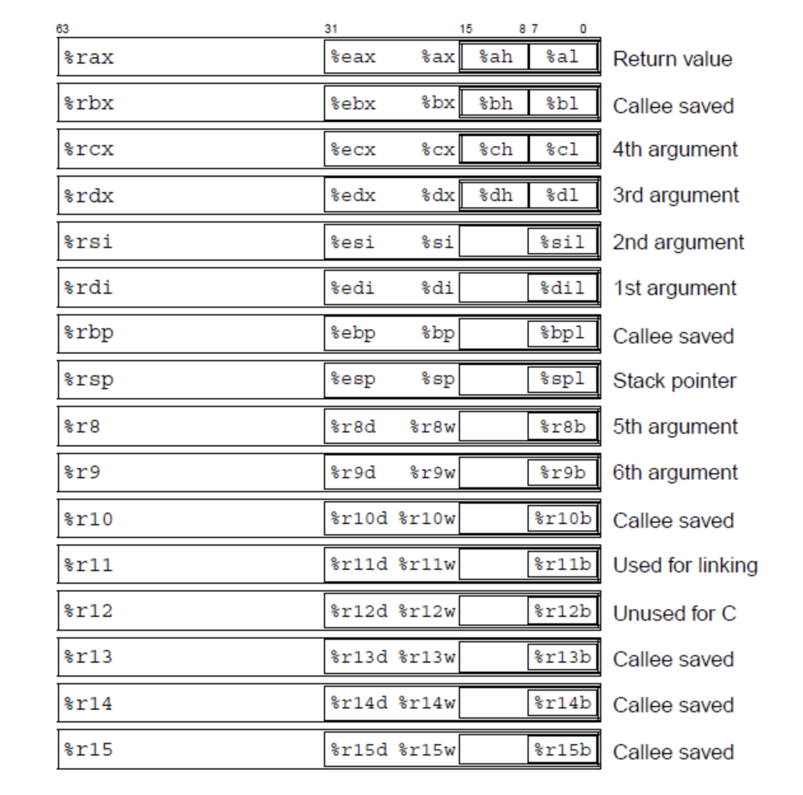
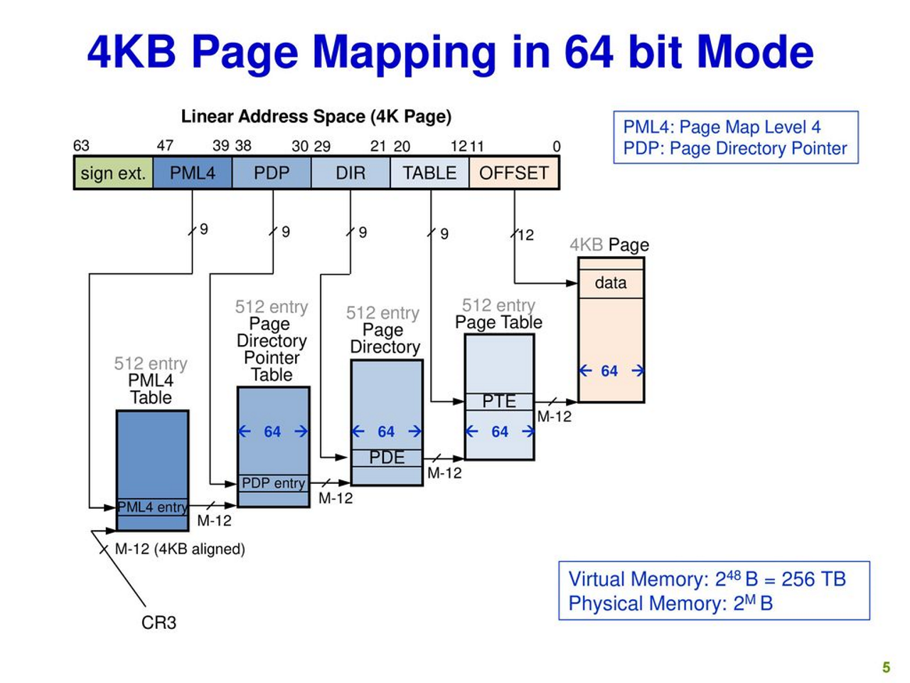
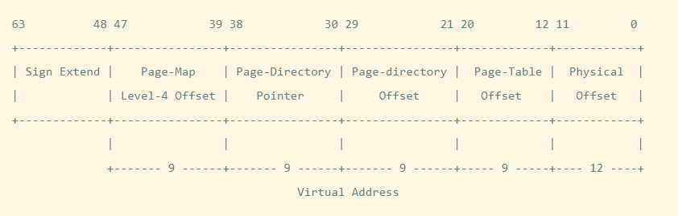

# Weekly I learned
## General Purpose Register

- %rax caller-saved
    - %rax 레지스터는 함수 호출과 반환 값에 사용됩니다. 호출자 함수에서 호출된 함수로 값을 전달하고, 호출된 함수는 %rax 레지스터를 통해 반환 값을 돌려줍니다. 이는 호출된 함수가 retq 명령을 사용하여 값을 반환할 때 %rax 레지스터에 저장하게 됩니다.

- %rdi~r9 caller-saved
    - %rdi, %rsi, %rdx, %rcx, %r8, %r9 레지스터는 호출된 함수로 전달되는 인수(매개변수)를 담당합니다. 만약 매개변수가 6개를 넘어가는 경우, 나머지 매개변수는 스택을 통해 전달됩니다.
    - 순서는 %rdi, %rsi, %rdx, %rcx, %r8, %r9 레지스터 순서대로 전달됩니다.

- %r10~r11 caller-saved
    - %r10와 %r11 레지스터는 caller-saved 레지스터로, 함수 내에서 임시로 사용하거나 버릴 수 있는 레지스터입니다.
    - 주로 함수 내에서 지역 변수로 사용하며, 호출된 함수가 반환될 때는 복원하지 않아도 됩니다.

- %rsp callee-saved
    - %rsp 레지스터는 스택의 최상위(top) 주소를 가리키며, 스택 프레임의 시작 지점을 나타냅니다.
    - 호출된 함수 내에서 스택을 조작하더라도, 함수 종료 시에는 원래의 %rsp 값으로 복원되어야 하므로 callee-saved 레지스터로 분류됩니다.

- %rbx, %rbp, %r12~r15 callee-saved
    - 이 레지스터들은 호출된 함수 내에서 사용되며, 호출자 함수에 영향을 주지 않도록 보존되어야 합니다.
    - 호출된 함수 내에서 값을 변경할 수 있지만, 함수 종료 시에는 이전의 값을 복원해야 합니다.

- %rip = program counter(PC)
    - %rip 레지스터는 현재 실행 중인 명령의 주소를 가리키며, 명령의 위치를 추적하는 데 사용됩니다. 함수 호출 및 반환과 관련이 있으며, 호출된 함수가 반환하면 %rip 값도 변경됩니다.

>이러한 레지스터는 x86 아키텍처에서 프로그램의 실행과 함수 호출을 관리하는 데 중요한 역할을 합니다. callee-saved 레지스터는 호출된 함수와 호출자 함수 간의 상호 작용에서 중요하며, 호출된 함수가 이러한 레지스터를 변경한 경우, 함수 종료 시에 이전 값으로 복원해야 합니다. caller-saved 레지스터는 함수 호출과 반환 값을 처리하는 데 사용됩니다.

## Control Register

컨트롤 레지스터란 운영체제의 운영 모드를 변경하고, 현재 운영 중인 모드의 기능을 제어하는 레지스터 입니다. CR0, CR1, CR2, CR3, CR4 총 5개의 컨트롤 레지스터가 존재합니다. (x86-64 프로세서에서는 CR8이 추가) 

- CR3 (Control Register 3)
    - CR3 레지스터는 페이지 테이블 주소를 저장하는 데 사용됩니다. 페이지 테이블은 가상 주소를 물리 주소로 매핑하는 데 필요한 정보를 담고 있는 데이터 구조입니다.
    - 운영 체제는 프로세스 간에 컨텍스트를 스위치할 때 CR3 레지스터 값을 변경하여 해당 프로세스의 가상 주소 공간을 적절한 물리 주소로 매핑합니다.
    - CR3 레지스터는 페이지 테이블의 기저 주소를 저장하므로, 이 레지스터의 값을 변경하면 가상 주소 공간이 변경됩니다.

- CR2 (Control Register 2)
    - CR2 레지스터는 현재 프로세스에서 발생한 페이지 폴트(exception)의 가상 주소를 저장합니다.
    - 페이지 폴트는 메모리 접근 중에 잘못된 주소를 참조하거나 해당 페이지가 메모리에 없을 때 발생합니다.
    - 페이지 폴트가 발생하면 CPU는 CR2 레지스터에 저장된 가상 주소를 참조하여 오류 처리 및 예외 핸들링을 수행합니다.

>CR3와 CR2 레지스터는 운영 체제의 가상 메모리 관리와 예외 처리에 중요한 역할을 합니다. CR3는 페이지 테이블의 주소를 변경하여 프로세스 간의 메모리 공간을 분리하고, CR2는 페이지 폴트 발생 시 오류를 식별하는 데 사용됩니다.

## Virtual Memory

- User Virtual Memory (사용자 가상 메모리)
    - 사용자 프로세스(응용 프로그램)가 실행되는 동안 사용하는 가상 메모리 공간입니다.
    - 각 사용자 프로세스는 자체적인 가상 메모리 공간을 가지며, 이 공간에서 코드, 데이터, 스택, 힙 등의   세그먼트를 관리합니다.
    - 사용자 가상 메모리는 사용자 프로세스에게 할당되고, 각 프로세스는 이 가상 메모리를 사용하여 자신의 작업을 수행합니다.
    - 사용자 프로세스는 직접 이 영역에 액세스할 수 있지만, 다른 프로세스의 사용자 가상 메모리에 접근할 수는 없습니다.
    - 사용자 모드(User Mode)에서 실행 중인 코드는 일반적으로 이 가상 메모리에서 동작합니다.
- Kernel Virtual Memory (커널 가상 메모리)
    - 운영 체제 커널의 실행 및 운영을 지원하기 위한 가상 메모리 공간입니다.
    - 커널 가상 메모리에는 운영 체제의 코드, 데이터, 디바이스 드라이버 및 커널 데이터 구조(프로세스 테이블, 파일 시스템 캐시 등)가 위치합니다.
    - 커널 가상 메모리는 사용자 프로세스에 비해 더 높은 권한을 가지며, 시스템 호출 또는 인터럽트를 통해 호출되는 코드에서만 액세스할 수 있습니다.
    - 이 영역은 운영 체제와 하드웨어 간의 인터페이스 역할을 하며, 시스템 리소스 및 하드웨어 자원에 접근하는 데 사용됩니다.
    - 커널 가상 메모리는 커널 모드(Kernel Mode)에서 실행 중인 코드에 의해 사용됩니다.

>이러한 구분은 시스템의 안정성과 보안을 유지하면서 사용자 프로세스와 운영 체제 간의 상호 작용을 관리하는 데 중요합니다. 사용자 가상 메모리와 커널 가상 메모리는 하나의 물리적 메모리에서 독립적으로 매핑되며, 이를 통해 여러 프로세스가 동시에 실행되고 운영 체제와 상호 작용할 수 있게 됩니다.

## PML4의 존재 이유

모든 유저 프로세스는 가상 주소 상에서 동작하며, 가상 주소에서 물리 주소로의 번역은 MMU라는 하드웨어가 지원합니다. 이 때, MMU는 소프트웨어, 즉 커널이 구성한 페이지 테이블을 보게 됩니다. 

커널은 자신의 주소공간에 프로세스별 페이지 테이블을 구성해 놓고, 각 프로세스가 실행될 때 마다 CR3 레지스터에 해당 페이지 테이블 주소를 적어줌으로써 MMU가 그 페이지 테이블을 볼 수 있도록 해줍니다. 정확히는 페이지 테이블의 엔트리들을 타고타고 들어가서 최하단 페이지 테이블의 PTE(Page Table Entry)를 찾아 물리주소를 알아내게 됩니다. 이 때, 주의할 점은 페이지 테이블의 엔트리에는 '물리주소'가 적혀야 한다는 것입니다.  하드웨어인 MMU는 가상주소라는 개념을 이해하지 못하고 단지 그 PTE에 적힌 물리 주소를 참고해서 자신의 임무를 수행할 뿐이기 때문입니다.

이전 32bit 컴퓨터 체계에서는 페이지 테이블이 딱 2단계만 있으면 충분했습니다. 각 페이지 테이블의 크기 자체도 페이지 하나의 크기를 가져야 하는데, 주소값(포인터)의 크기가 `4 Byte` ( 2^2 ) 인 32 bit 컴퓨터에서 하나의 페이지 테이블에 들어갈 수 있는 엔트리의 개수는 `1024`개 ( 2^10 )가 됩니다. ( 2^2∗2^10=2^12 즉, 페이지 하나의 크기인 `4 KiB`가 됩니다.)

상위 페이지 테이블인 Page-Directory는 `1024`개의 엔트리를 가질 수 있고, 각 엔트리는 하위 페이지 테이블의 시작 주소를 담고 있습니다. 하위 페이지 테이블인 Page-Table 또한 `1024`개의 PTE를 가질 수 있습니다. 그렇다면 총 가능한 PTE의 개수가 2^20개가 되고, 이 PTE에 해당하는 페이지 안에서의 오프셋 또한 페이지의 바이트 크기(`4 KiB` = `4096 Byte` = 2^12) 만큼 가능하기 때문에 결국 가능한 주소의 개수는 2^20∗2^12=2^32개가 됩니다.

하지만 64bit 컴퓨터의 등장으로 페이지 테이블 개수가 증가할 수 밖에 없어집니다. 이 중 48bit만 사용한다고 해도 페이지 테이블이 4단계의 구성을 지녀야 합니다. 이유는, bit의 개수 자체도 늘었을 뿐만 아니라 64bit에서는 주소값(포인터)의 크기가 `8 Byte` 이므로 페이지 테이블 당 엔트리 개수가 `512`개 ( 2^9 )로 줄어들기 때문입니다. 결국 4단계의 페이지 테이블 구성을 통해 총 가능한 PTE의 개수가 2^9∗2^9∗2^9∗2^9=2^36 개가 되고, 페이지 오프셋 개수 2^12 를 곱해주면 가능한 주소의 개수는 정확히 2^36∗2^12=2^48 개가 됩니다.

그래서 4단계의 페이지 테이블 구성을 통해 64bit 컴퓨터의 가상 주소가 동작하게 됩니다. 각 단계별로 페이지 테이블 이름이 존재합니다.

>PML4(page-map level 4) - PDP(page-directory pointer) - PD(page-directory) - PT(page-table)

이렇게 페이지 테이블이 구성되어 있을 때, MMU는 어떻게 이 페이지 테이블의 주소값을 보고 번역을 하게 됩니다. 사실 가상 주소는 위에서 언급한 단계별 페이지 테이블의 인덱스 정보를 가진 어떤 값을 의미합다.

따라서 MMU는 어떤 가상 주소를 가지고, 그 안에 포함된 인덱스 정보를 활용하여 테이블을 보면서해당하는 PTE를 찾을 수 있게 됩니다.